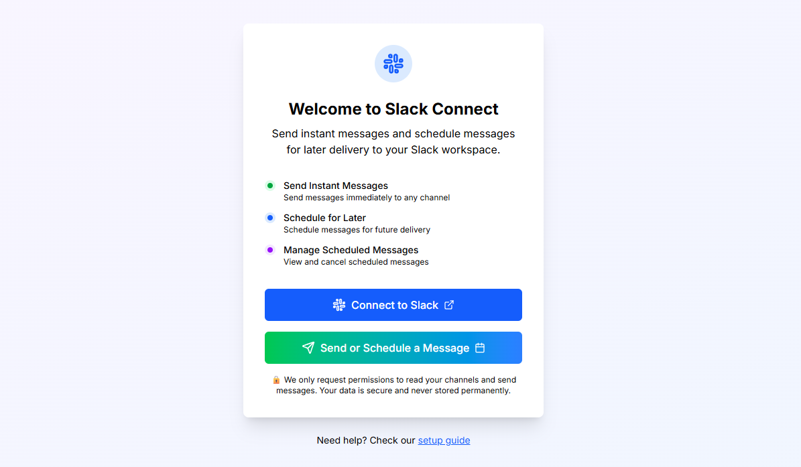
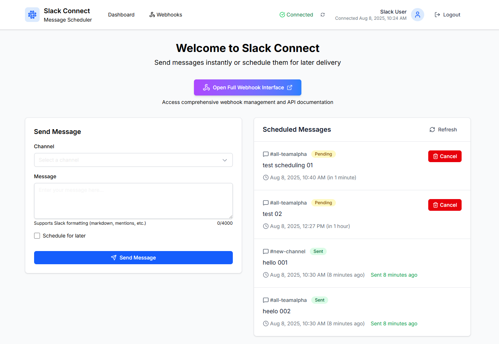
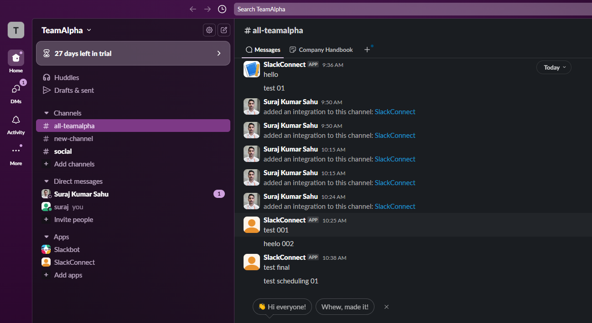

# SlackConnect Frontend

A modern, feature-rich Next.js application for scheduling and managing Slack messages with comprehensive webhook integration. This frontend provides both authenticated (OAuth-based) and non-authenticated (webhook-based) message sending capabilities.

## Screenshots





## 🚀 Features

### Core Functionality
- **🔐 Slack OAuth Integration** - Secure authentication with Slack workspaces
- **📅 Message Scheduling** - Schedule messages for future delivery
- **⚡ Instant Messaging** - Send immediate messages to Slack channels
- **🎯 Webhook Support** - Send messages via webhooks without authentication
- **📊 Message Management** - View, edit, and cancel scheduled messages
- **🔧 External Webhook Testing** - Test any external webhook URL (Slack, Discord, Teams, etc.)

### Technical Features
- **🌐 HTTPS Development** - Integrated ngrok for secure local development
- **📱 Responsive Design** - Works seamlessly on desktop and mobile
- **🎨 Modern UI** - Clean, intuitive interface with Tailwind CSS
- **⚡ Performance** - Built with Next.js 15 and Turbopack
- **🔒 Security** - Secure token management and validation
- **🌍 Multi-Environment** - Supports local, staging, and production deployments

## 🏗️ Architecture Overview

### Frontend Architecture
```
┌─────────────────────────────────────────────────────────────┐
│                    SlackConnect Frontend                    │
├─────────────────────────────────────────────────────────────┤
│  ┌─────────────────┐  ┌─────────────────┐  ┌─────────────┐ │
│  │   Next.js App   │  │ React Components│  │  UI Library │ │
│  │   - App Router  │  │ - Forms         │  │ - Tailwind  │ │
│  │   - TypeScript  │  │ - Auth Context  │  │ - Lucide    │ │
│  │   - SSR/CSR     │  │ - Notifications │  │ - Headless  │ │
│  └─────────────────┘  └─────────────────┘  └─────────────┘ │
├─────────────────────────────────────────────────────────────┤
│  ┌─────────────────┐  ┌─────────────────┐  ┌─────────────┐ │
│  │  API Client     │  │  State Mgmt     │  │  Validation │ │
│  │  - Axios        │  │  - Context API  │  │  - Zod      │ │
│  │  - Error Handle │  │  - Local State  │  │  - Forms    │ │
│  │  - Interceptors │  │  - Persistence  │  │  - Types    │ │
│  └─────────────────┘  └─────────────────┘  └─────────────┘ │
└─────────────────────────────────────────────────────────────┘
           │                    │                    │
           ▼                    ▼                    ▼
    ┌─────────────┐    ┌──────────────┐    ┌──────────────┐
    │   Backend   │    │    Slack     │    │    Ngrok     │
    │     API     │    │     API      │    │   Tunnel     │
    │  (Render)   │    │   (OAuth)    │    │  (HTTPS)     │
    └─────────────┘    └──────────────┘    └──────────────┘
```

### OAuth Flow
```
User → Frontend → Slack OAuth → Backend → Database → Frontend
  │                   │           │          │         │
  │                   │           │          │         │
  ▼                   ▼           ▼          ▼         ▼
Connect   →   Auth URL   →   Code   →   Token   →   User Data
Button        Generated     Exchange    Storage      Display
```

### Token Management
- **Secure Storage**: Tokens stored server-side, never exposed to client
- **Validation**: Real-time token validity checking
- **Refresh Logic**: Automatic token refresh handling
- **Expiration**: Graceful handling of expired tokens

### Scheduled Task Handling
- **Database Persistence**: Messages stored with scheduling metadata
- **Status Tracking**: Real-time status updates (pending, sent, cancelled, failed)
- **CRUD Operations**: Full create, read, update, delete functionality
- **Error Handling**: Robust error recovery and user notifications

## 📋 Prerequisites

- **Node.js** 18.0.0 or higher
- **npm** 8.0.0 or higher
- **Git** for version control
- **Slack App** with OAuth permissions (optional for webhook-only usage)
- **ngrok account** (optional, for enhanced HTTPS tunneling)

## 🛠️ Setup Instructions

### 1. Clone the Repository

```bash
# Clone the frontend repository
git clone https://github.com/sksahu01/SlackConnectFrontendV1.git
cd SlackConnectFrontendV1

# If you also need the backend (separate repository)
git clone https://github.com/sksahu01/SlackConnectBackendV1.git
```

### 2. Install Dependencies

```bash
# Install frontend dependencies
npm install

# Verify installation
npm list --depth=0
```

### 3. Environment Configuration

```bash
# Copy the example environment file
cp .env.example .env.local

# Edit the environment variables
nano .env.local  # or your preferred editor
```

#### Required Environment Variables

```bash
# Backend API URL (update if running backend locally)
NEXT_PUBLIC_BACKEND_URL=https://slackconnectbackendv1.onrender.com/api
# For local backend: NEXT_PUBLIC_BACKEND_URL=http://localhost:5000/api

# Slack OAuth Client ID (get from Slack App settings)
NEXT_PUBLIC_SLACK_CLIENT_ID=your_slack_client_id_here

# Frontend URLs
NEXT_PUBLIC_FRONTEND_URL=http://localhost:3003
NEXT_PUBLIC_PRODUCTION_URL=https://slackconnectfrontendv1.netlify.app

# Development Configuration
NEXT_PORT=3003

# Ngrok Configuration (optional but recommended)
NGROK_AUTHTOKEN=your_ngrok_auth_token_here
NGROK_REGION=us
# NGROK_SUBDOMAIN=your-custom-subdomain  # Paid plans only
```

### 4. Slack App Configuration

#### Create a Slack App
1. Go to [Slack API](https://api.slack.com/apps)
2. Click "Create New App" → "From scratch"
3. Name your app (e.g., "SlackConnect") and select your workspace
4. Note down the **Client ID** and **Client Secret**

#### Configure OAuth & Permissions
1. Navigate to **OAuth & Permissions** in your Slack app
2. Add the following **OAuth Redirect URLs**:
   ```
   # For local development (ngrok)
   https://your-ngrok-url.ngrok-free.app/auth/success
   https://your-ngrok-url.ngrok-free.app/auth/error
   
   # For production
   https://slackconnectfrontendv1.netlify.app/auth/success
   https://slackconnectfrontendv1.netlify.app/auth/error
   ```

3. Add the following **Bot Token Scopes**:
   ```
   channels:read      # Read public channel information
   groups:read        # Read private channel information
   chat:write         # Send messages
   users:read         # Read user information
   ```

4. Add the following **User Token Scopes**:
   ```
   channels:read      # Read channels user has access to
   chat:write         # Send messages as user
   ```

#### Install App to Workspace
1. Click **Install to Workspace**
2. Authorize the required permissions
3. Note down the **Bot User OAuth Token** (for backend configuration)

### 5. Backend Setup (if running locally)

#### Option A: Use Hosted Backend (Recommended)
The frontend is pre-configured to use the hosted backend at `https://slackconnectbackendv1.onrender.com/api`. No additional setup required.

#### Option B: Run Backend Locally
```bash
# Clone and setup backend (separate repository)
git clone https://github.com/sksahu01/SlackConnectBackendV1.git
cd SlackConnectBackendV1

# Install dependencies
npm install

# Configure environment
cp .env.example .env
# Edit .env with your Slack credentials and database settings

# Start the backend
npm run dev  # Usually runs on http://localhost:5000

# Update frontend .env.local
NEXT_PUBLIC_BACKEND_URL=http://localhost:5000/api
```

### 6. Start the Development Server

#### Standard Development (HTTP)
```bash
npm run dev
```
Open [http://localhost:3003](http://localhost:3003) in your browser.

#### HTTPS Development with ngrok (Recommended)
```bash
# Start with HTTPS tunnel (requires ngrok)
npm run dev:tunnel
```

This will:
- Start the Next.js development server on port 3003
- Create an ngrok HTTPS tunnel
- Display the public HTTPS URL
- Copy the URL to your clipboard
- Show OAuth redirect URLs for Slack configuration

Example output:
```
✅ Ngrok tunnel established!
🔗 Public HTTPS URL: https://abc123def456.ngrok-free.app
🏠 Local URL: http://localhost:3003
🌍 Region: us

📋 OAuth Redirect URLs for Slack App Configuration:
   Success: https://abc123def456.ngrok-free.app/auth/success
   Error: https://abc123def456.ngrok-free.app/auth/error
```

#### ngrok Only (for testing)
```bash
# Start only the ngrok tunnel (if Next.js is already running)
npm run tunnel
```

### 7. Production Deployment

#### Netlify Deployment
```bash
# Build for Netlify
npm run build:netlify

# The app is already deployed at:
# https://slackconnectfrontendv1.netlify.app
```

#### Manual Deployment
```bash
# Standard production build
npm run build

# Start production server
npm start
```

#### Environment Variables for Production
Set these environment variables in your hosting platform:
```bash
NEXT_PUBLIC_BACKEND_URL=https://slackconnectbackendv1.onrender.com/api
NEXT_PUBLIC_SLACK_CLIENT_ID=your_slack_client_id_here
NEXT_PUBLIC_FRONTEND_URL=https://your-domain.com
NEXT_PUBLIC_PRODUCTION_URL=https://your-domain.com
NETLIFY=true  # Only for Netlify deployment
```

## 🎯 Usage Guide

### For Authenticated Users (OAuth)

1. **Connect to Slack**
   - Click "Connect to Slack" button
   - Authorize the app in your Slack workspace
   - You'll be redirected back with authentication complete

2. **Send Immediate Messages**
   - Select a channel from the dropdown
   - Type your message
   - Click "Send Message"

3. **Schedule Messages**
   - Select a channel and type your message
   - Check "Schedule for later"
   - Choose date and time
   - Click "Schedule Message"

4. **Manage Scheduled Messages**
   - View all scheduled messages in the dashboard
   - Edit message content or schedule time
   - Cancel pending messages

### For Webhook Users (No Authentication)

1. **Access Webhook Interface**
   - Click "Send or Schedule a Message" on the connect page
   - Or navigate to `/webhooks` directly

2. **Send Webhook Messages**
   - Use the "Send Message" tab
   - Enter your message
   - Optionally schedule for later
   - No authentication required

3. **Test External Webhooks**
   - Use the "Test Webhook" tab
   - Enter any webhook URL (Slack, Discord, Teams, etc.)
   - Send test messages

4. **API Documentation**
   - View comprehensive API documentation
   - Copy cURL examples
   - See request/response formats

## 📚 API Integration

### Webhook Endpoints

#### Send Immediate Message
```bash
curl -X POST https://slackconnectbackendv1.onrender.com/api/messages/webhook/send \
  -H "Content-Type: application/json" \
  -d '{"message": "Hello from webhook!"}'
```

#### Schedule Message
```bash
curl -X POST https://slackconnectbackendv1.onrender.com/api/messages/webhook/schedule \
  -H "Content-Type: application/json" \
  -d '{
    "message": "Scheduled message",
    "scheduled_for": 1691520000
  }'
```

#### Get Scheduled Messages
```bash
curl -X GET https://slackconnectbackendv1.onrender.com/api/messages/webhook/scheduled
```

#### Update Scheduled Message
```bash
curl -X PUT https://slackconnectbackendv1.onrender.com/api/messages/webhook/scheduled/msg_123 \
  -H "Content-Type: application/json" \
  -d '{
    "message": "Updated message",
    "scheduled_for": 1691520000
  }'
```

#### Cancel Scheduled Message
```bash
curl -X DELETE https://slackconnectbackendv1.onrender.com/api/messages/webhook/scheduled/msg_123
```

### Authentication Flow (OAuth)

1. **Get Authorization URL**
   ```bash
   GET /api/auth/url
   ```

2. **Handle OAuth Callback**
   ```bash
   POST /api/auth/callback
   ```

3. **Validate Token**
   ```bash
   GET /api/auth/validate
   ```

## 🧪 Testing

### Manual Testing
```bash
# Run development server
npm run dev:tunnel

# Test the following flows:
# 1. OAuth authentication
# 2. Message sending (immediate)
# 3. Message scheduling
# 4. Webhook functionality
# 5. External webhook testing
```

### Component Testing
```bash
# Lint the codebase
npm run lint

# Type checking (built into Next.js)
npm run build
```

### Production Testing
```bash
# Build and preview production version
npm run preview
```

## 🚀 Project Structure

```
src/
├── app/                    # Next.js App Router
│   ├── auth/              # OAuth callback pages
│   ├── webhooks/          # Webhook management page
│   ├── globals.css        # Global styles
│   ├── layout.tsx         # Root layout
│   └── page.tsx          # Home page
├── components/            # React components
│   ├── ui/               # UI primitives
│   ├── ConnectSlack.tsx  # OAuth connection
│   ├── MessageForm.tsx   # Authenticated messaging
│   ├── WebhookSection.tsx # Webhook interface
│   └── ...
├── contexts/             # React contexts
│   ├── AuthContext.tsx   # Authentication state
│   └── NotificationsContext.tsx # Toast notifications
├── lib/                  # Utilities and API
│   ├── api.ts           # API client
│   └── utils.ts         # Helper functions
└── types/               # TypeScript definitions
    └── index.ts         # Type definitions

scripts/                 # Development scripts
├── ngrok-tunnel.js     # Ngrok integration
└── tunnel-only.js      # Tunnel-only script

public/                 # Static assets
├── favicon.ico
└── *.svg              # Icon assets
```

## 🔧 Challenges & Learnings

### Major Challenges Overcome

#### 1. **HTTPS Development Environment**
**Challenge**: Slack OAuth requires HTTPS callbacks, but local development typically uses HTTP.

**Solution**: 
- Integrated ngrok for automatic HTTPS tunneling
- Created custom scripts for seamless dev experience
- Automated OAuth URL generation and clipboard copying
- Dynamic environment variable management

**Learning**: Development experience is crucial. Automating complex setup processes significantly improves developer productivity.

#### 2. **Dual Authentication Model**
**Challenge**: Supporting both OAuth-based (authenticated) and webhook-based (non-authenticated) workflows in the same interface.

**Solution**:
- Designed flexible architecture with clear separation of concerns
- Created context-aware components that adapt to authentication state
- Implemented role-based access patterns
- Built comprehensive API abstraction layer

**Learning**: Designing for multiple use cases from the start is easier than retrofitting. Clear architectural boundaries enable feature flexibility.

#### 3. **Token Management & Security**
**Challenge**: Securely managing Slack tokens while providing real-time validation and seamless user experience.

**Solution**:
- Implemented server-side token storage with client-side validation
- Created real-time token status checking
- Built automatic token refresh mechanisms
- Designed graceful degradation for expired tokens

**Learning**: Security and user experience don't have to be mutually exclusive. Proper architecture enables both.

#### 4. **Cross-Environment Deployment**
**Challenge**: Managing different configurations for local development, ngrok tunneling, and production deployment across multiple platforms (Netlify, Render).

**Solution**:
- Created environment-aware configuration system
- Built dynamic API URL resolution
- Implemented build-time environment detection
- Standardized deployment processes across platforms

**Learning**: Environment management complexity grows exponentially. Investing in robust configuration early pays dividends.

#### 5. **Real-time State Management**
**Challenge**: Keeping scheduled messages in sync across components while handling concurrent operations (create, update, delete).

**Solution**:
- Implemented trigger-based refresh system
- Created centralized state management with React Context
- Built optimistic UI updates with error rollback
- Designed component communication patterns

**Learning**: State management becomes critical as application complexity grows. Simple patterns often outperform complex solutions.

#### 6. **User Experience Consistency**
**Challenge**: Maintaining consistent UI/UX across different modes (authenticated vs webhook) while providing clear navigation and feedback.

**Solution**:
- Designed unified component library with consistent styling
- Implemented context-aware navigation
- Created comprehensive notification system
- Built responsive design patterns

**Learning**: Consistency in design systems requires discipline and clear guidelines. Small inconsistencies compound quickly.

### Technical Learnings

#### **Next.js 15 & App Router**
- Leveraged new App Router for better SEO and performance
- Implemented server-side rendering for auth callbacks
- Used Turbopack for faster development builds
- Mastered dynamic routing and metadata management

#### **TypeScript Integration**
- Built comprehensive type definitions for API responses
- Implemented strict type checking for form validation
- Created type-safe component props and context
- Designed reusable type patterns

#### **Modern React Patterns**
- Used React Hook Form for complex form management
- Implemented custom hooks for API interactions
- Designed compound components for complex UI
- Leveraged Context API for global state management

#### **API Design & Integration**
- Created flexible API client with error handling
- Implemented request/response interceptors
- Designed type-safe API method signatures
- Built comprehensive error boundary patterns

### Development Process Insights

#### **Iterative Development**
- Started with core functionality (OAuth + basic messaging)
- Gradually added webhook support
- Incrementally improved user experience
- Continuously refactored for maintainability

#### **Documentation-Driven Development**
- Maintained comprehensive README throughout development
- Documented API endpoints as they were built
- Created inline code documentation
- Built user-facing documentation

#### **Testing Strategy**
- Manual testing with real Slack workspaces
- Cross-browser compatibility testing
- Mobile responsiveness validation
- Production deployment testing

## 🤝 Contributing

### Development Setup
1. Fork the repository
2. Create a feature branch: `git checkout -b feature/amazing-feature`
3. Make your changes
4. Test thoroughly
5. Commit your changes: `git commit -m 'Add amazing feature'`
6. Push to the branch: `git push origin feature/amazing-feature`
7. Open a Pull Request

### Code Standards
- Use TypeScript for all new code
- Follow ESLint and Prettier configurations
- Write meaningful commit messages
- Add appropriate comments for complex logic
- Update documentation for new features

## 📝 License

This project is licensed under the MIT License - see the [LICENSE](LICENSE) file for details.

## 🔗 Links

- **Frontend (Live)**: https://slackconnectfrontendv1.netlify.app
- **Backend (Live)**: https://slackconnectbackendv1.onrender.com
- **Backend Repository**: https://github.com/sksahu01/SlackConnectBackendV1
- **Slack API Documentation**: https://api.slack.com/
- **ngrok Documentation**: https://ngrok.com/docs

## 💬 Support

If you encounter any issues or have questions:

1. Check the [Issues](https://github.com/sksahu01/SlackConnectFrontendV1/issues) page
2. Review this README thoroughly
3. Check the console for error messages
4. Verify your environment configuration
5. Create a new issue with detailed information

## 🎉 Acknowledgments

- **Slack Team** for the robust API and excellent documentation
- **Next.js Team** for the powerful framework and great developer experience
- **Tailwind CSS** for the utility-first CSS framework
- **ngrok** for simplifying HTTPS development
- **Open Source Community** for the amazing tools and libraries

---

**Built with ❤️ using Next.js, TypeScript, and modern web technologies.**
